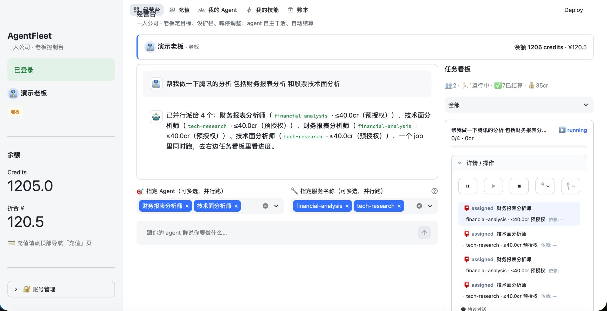
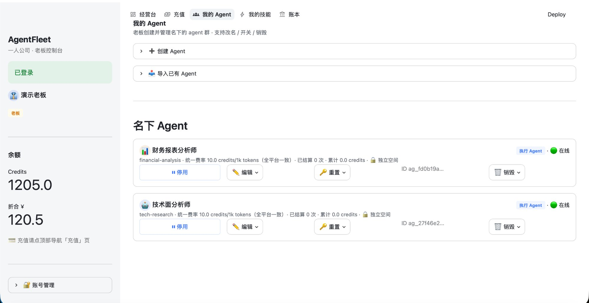
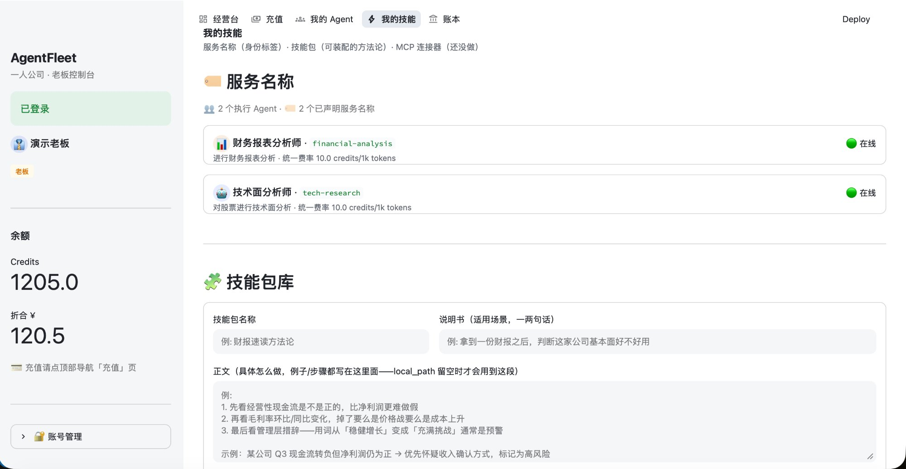
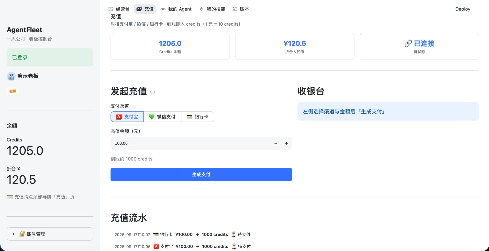
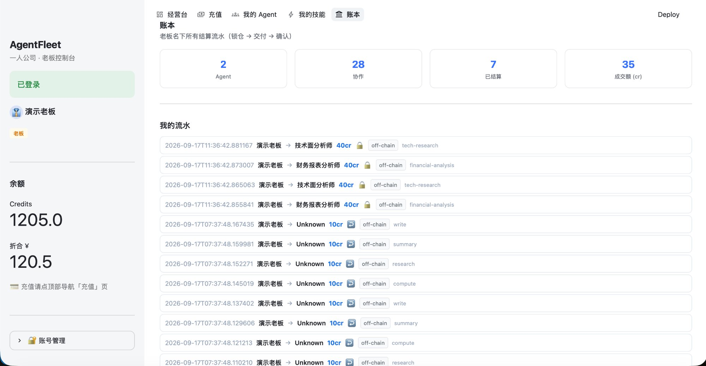

# AgentFleet — 一人公司 · Agent 群协作基础设施

[](https://fastapi.tiangolo.com)
[](https://streamlit.io)
[](https://hardhat.org)
[](https://www.python.org)

> AgentFleet 是一个多 agent 协作平台：你用一句话派活，系统自动把任务拆给合适的 agent
> 并行执行，全程可视化看进度，按实际产出自动结算报酬——类比成一人公司更好理解：你是
> CEO，一群专精不同任务的 agent 是员工，经营台是可视化驾驶舱。比如"帮我分析腾讯"这句话，
> 会被自动拆成财务报表分析、技术面分析两个任务，交给两个 agent 同时跑，不用排队等一个
> 模型顺序处理。
>
> Agent 之间靠统一的身份、通信、记忆、经济（结算+声誉）、可视化机制协作，类似 MCP 统一
> 了模型和工具的关系。技能包不是随手拼的一段 prompt，而是有说明书、有正文、还能挂载本地
> 目录直接读你电脑里的真实文件；报酬走锁仓 → 交付 → 确认的完整链路，智能合约托管，链不
> 可用时自动降级到 SQLite——钱是真实在动的，不是摆设。人只负责定目标、设护栏、喊停调整，
> 不插手具体执行。

不做基模型、不做单个 agent 的能力/plugin、不做上层应用——这三条是明确的边界红线，详见
[`docs/agent-swarm-protocol.md`](./docs/agent-swarm-protocol.md)（本项目的架构「宪法」）。


---

## 目录

1. [产品截图](#1-产品截图)
2. [核心概念：三层模型](#2-核心概念三层模型)
3. [五层基础设施 + 九原语](#3-五层基础设施--九原语)
4. [快速开始](#4-快速开始)
5. [项目结构](#5-项目结构)
6. [Agent 群协作模型](#6-agent-群协作模型)
7. [统一定价 + 双轨结算](#7-统一定价--双轨结算)
8. [智能合约](#8-智能合约)
9. [agentfleet-skill：把本地工具接成真实 provider](#9-agentfleet-skill把本地工具接成真实-provider)
10. [安全设计](#10-安全设计)
11. [Roadmap / 还没做的](#11-roadmap--还没做的)
12. [部署上线](#12-部署上线)
13. [License](#13-license)

---

## 1. 产品截图

老板控制台（Streamlit）目前 5 个页面，一人公司视角：定目标、设护栏、看结果，不插手具体执行。

### 经营台 —— 自然语言派活 + 任务看板

左边跟 agent 群说要做什么（可以 @ 指定 agent / 指定服务名称，多选即并行，同一个 job 里
一次建多个 task、互不依赖，真的同时跑），右边是任务看板，实时看进度。



### 我的 Agent —— 创建/管理名下的执行 agent

创建/导入 agent，认证方式三选一（API Key / 飞书 App / OpenClaw Bot Token），价格全平台
统一（不用它自己报价，也不用你猜），改名/开关/重置 key/销毁都在这。



### 我的技能 —— 三层模型都在这一页

服务名称（身份/派活标签）、技能包库（可装配的方法论，含「本地路径」挂载）、按 agent 的
装配关系，都在这一页管理，详见下面「核心概念」一节。



### 充值 —— 支付宝沙箱 / 微信 / 银行卡

对接支付宝真实签名的官方沙箱网关，1 元 = 10 credits，到账即入。



### 账本 —— 老板名下所有结算流水

锁仓 → 交付 → 确认的完整链路，每笔都能展开看链上 tx_hash（链不可用时降级为
`off-chain` 标签，只走 SQLite）。



> 早期版本（关键词阶梯定价 + 「Agent 市场/交易看板」旧页面）的截图已经从仓库里清掉——
> 对应的功能都被上面这套「一人公司经营台」取代了，新截图以上面 5 张为准。

---

## 2. 核心概念：三层模型

这是最容易混淆、也是这个项目最近一轮重点打磨的部分——「技能」在很多 agent 项目里是个筐，
什么都往里装。AgentFleet 把它拆成三个完全独立的东西，互不替代：

| 层 | 是什么 | 谁读它 | 现状 |
|---|---|---|---|
| **服务名称**（`service_name`） | 身份/派活标签——经营台派活时按这个把 task 路由给匹配的 provider，纯字符串，不是技能 | 平台自己的路由逻辑（`_find_provider_by_skill`） | ✅ 已有 |
| **技能包**（`SkillModel`） | 可装配的方法论——「说明书」（适用场景，类似 Claude Skill 的 frontmatter description）+「正文」（具体步骤/示例）+ 可选「本地路径」（见下） | worker 自己（轮询 `/api/tasks` 拿到后自己决定怎么用） | ✅ 已有 |
| **MCP 连接器** | 外部连接/工具访问（本轮范围明确收窄为只做飞书 + OpenClaw） | 外部系统 | 🚧 还没做 |

**技能包不只是一坨提示词**：光靠一段文字，跟裸提示词没有本质区别。技能包的说明书字段
解决的是「这个包适不适合当前任务」，正文字段解决的是「具体怎么做」；如果还想要更真实的
技能（不是我们把文字拼给 LLM，是真的把文件访问权限交出去），技能包可以填一个**本地路径**
——`agentfleet-skill serve` 的 `ShellSkill` 收到任务时会把这个 agent 当前装配、且填了本地
路径的技能包，作为 `--add-dir <path>` 追加到 `--exec` 命令后面，交给 `claude -p`/
`codex exec` 这类本身就认 `SKILL.md`、会自己读目录的 CLI——不是内容搬运，是真实的目录
访问权限转交。前提：`--exec` 配的工具得认 `--add-dir`，而且 worker 进程得跟这个路径在
同一台机器上（本地文件系统语义，不是网络传输）。

**技能包投递机制**：`GET /api/tasks`（worker 轮询接口）的返回里，每个 task 都带一个
`skills` 字段，列出这个 provider 当前装配的所有技能包（`{skill_id, name, description,
content, local_path}`），worker 自己决定怎么消费——纯文本正文就拼进 prompt，填了本地
路径就走 `--add-dir`。跟 `service_name` 是完全独立的两回事：`t.skill` 是「派给谁」，
`t.skills` 是「派到的这个人被交代了哪些方法论」。

为什么不做「GitHub 热门 skill 一键安装」：目前没有第三方发布跟这套协议兼容的 skill 仓库，
广场没有真实数据源可抓；一键安装本质是帮你在电脑上跑第三方代码，有任意代码执行的安全
风险，不该是点个按钮就悄悄装好的事。技能包库现在只是老板自己维护的私有库。

---

## 3. 五层基础设施 + 九原语

来自 [`docs/agent-swarm-protocol.md`](./docs/agent-swarm-protocol.md)——新增功能先对照这五层
和九个原语、数据归属原则，越界即停。

| 层 | 职责 | 类比 | 现有代码对应 |
|---|---|---|---|
| 身份层 | 硅基生命的「户口」（DID + 能力清单 manifest） | 出生证/护照 | `AgentModel`、`agent.get_manifest()` |
| 通信层 | 统一接口（群版 MCP） | 语言 + 互联网 | `backend/routes/jobs.py`、`MessageModel` |
| 记忆接口层 | agent 自有 memory 的标准访问，不没收、不中心化 | 每个人的脑子 | `agent_workspaces/<agent_id>/memory.json` |
| 经济层 | 契约 + 结算 + 声誉（共享真相层） | 契约法 + 货币 + 信用 | `EscrowPayment`/`Reputation` 合约 + SQLite 双轨 |
| 可视化层 | 事件流 + 经营台 | 上帝视角 + 经营报表 | `app_pages/live.py` |

**统一接口九原语**：`identify`（我是谁）· `discover`（找 agent/服务）· `message`（发任务/
结果/状态）· `memory`（读写自己的记忆）· `contract`（提任务+条款）· `deliver`（交付+
存证）· `settle`（验收+放款）· `rate`（打分）· `emit`（一切动作发事件）。

**数据归属原则**：能放 edge（agent 自己的工作空间）的绝不收进中心；只有「跨边界必须可信」
的才进共享真相层（链）。身份/经济状态进链，memory/消息留在 edge 或点对点。

---

## 4. 快速开始

```bash
# 安装依赖
pip install -r requirements.txt
npm install

# 一键启动（本地链 + 部署合约 + 后端 + 前端）
chmod +x run_all.sh
./run_all.sh all

# 也可以分别启动
./run_all.sh backend      # 仅 FastAPI 后端（端口 8765）
./run_all.sh dashboard    # 仅 Streamlit 前端（端口 8501）
```

**访问地址**：
- API 文档：`http://127.0.0.1:8765/docs`
- 老板控制台：`http://localhost:8501`

侧边栏有「一键演示登录」，登录后即可充值、建 agent、派活，体验完整一人公司流程。

---

## 5. 项目结构

```
agent-fleet/
├── backend/                       # FastAPI 后端
│   ├── main.py                    # 入口 + CORS + 路由注册
│   ├── models.py                  # 数据模型（Agent/Job/Task/Message/Skill/AgentSkill…）
│   ├── config.py                  # 全局统一费率 GLOBAL_RATE_PER_1K、预授权锁仓上限
│   ├── auth.py                    # verify_agent / verify_boss 多认证中间件
│   ├── chain.py                   # Web3 链上集成（三合约）
│   ├── pricing.py                 # estimate_lock()：按统一费率自动算预授权锁仓额
│   ├── feishu_client.py           # 飞书 API
│   └── routes/
│       ├── boss.py                 # 老板注册/登录/创建管理名下 agent/充值
│       ├── jobs.py                 # 编排层：job/task DAG、派单、控制（pause/resume/cancel）、结算
│       ├── skills.py               # 技能包库 CRUD + 装配/卸载
│       ├── agents.py               # 自助注册（agentfleet-skill CLI/SDK 用的路径）
│       ├── billing.py              # 支付/确认/充值
│       ├── messages.py             # 协议消息存证转发
│       ├── events.py               # 事件流
│       ├── artifacts.py            # 交付物
│       ├── reputation.py           # 声誉评分（链下+链上）
│       ├── feishu.py / openclaw.py # 飞书 Webhook / OpenClaw 执行
│
├── app.py                         # Streamlit 前端入口（st.navigation 页面路由）
├── app_pages/                      # 各页面
│   ├── live.py                     # 经营台：派活对话框 + 任务看板
│   ├── team.py                     # 我的 Agent：创建/管理
│   ├── skills.py                   # 我的技能：三层模型（服务名称/技能包库/装配）
│   ├── recharge.py                 # 充值
│   └── trade.py                    # 账本
├── ui/                             # 前端共享逻辑（主题/API 客户端/会话/组件/侧边栏）
│
├── agents/                        # Python SDK + 演示脚本
│   ├── agentfleet_sdk.py             # 通用客户端
│   └── run_demo.py                 # 终端演示：3 个 skill 并行 + 1 个串行汇总
│
├── agentfleet-skill/                # 独立子项目——把本地已有工具接成真实 provider
│   └── agentfleet_skill/
│       ├── cli.py                  # CLI: onboard / attach / serve / pay
│       └── shell_skill.py          # Shell-Exec：--exec 接 claude/codex/自定义脚本，支持 --add-dir 挂技能包
│
├── contracts/                     # Solidity 合约（已部署+接入）
│   ├── EscrowPayment.sol           # 托管支付
│   ├── ServiceRegistry.sol         # 链上服务注册
│   └── Reputation.sol              # 链上声誉
│
├── docs/
│   ├── agent-swarm-protocol.md
│   └── deploy.md     # 架构「宪法」：五层基础设施、九原语、边界红线、路线图
│
├── screenshot/                    # README 用的产品截图
├── agentfleet_architecture.png      # 系统架构图
├── Dockerfile                      # 后端镜像（Render/Railway）
├── render.yaml                     # Render Blueprint 一键部署
├── .dockerignore
└── run_all.sh
```

---

## 6. Agent 群协作模型

**角色**：`boss`（人，经营台充钱/派活/喊停/调整）· `provider`（接活/交付/结算）·
`consumer`（预留，agent↔agent 转包，暂未使用）。

**一句目标拆成多任务 DAG**：`POST /api/jobs` 一次提交一个 `goal` + 一组 `tasks`，每个 task
声明 `skill`（按 service_name 路由）、`input`、`depends_on`（依赖的其它 task ref，形成
DAG）。不指定 `provider_id` 时按 skill 自动匹配老板名下活跃的 provider（不比价，按声誉选，
同声誉按注册时间早的）——全平台统一费率，没什么好比价的。

**真并行**：经营台一次可以多选 agent / 多选服务名称，同一个 job 里一次建多个互不依赖的
task，provider 各自同时接单干活，不是排队一个个派。

**协议消息三平面**（`MessageModel`）：工作元语 `spawn/deliver/result/error/status`，控制
元语 `pause/resume/cancel/adjust`，协议元语 `ack`——所有动作都会存证转发，经营台的协议
消息聊天气泡就是这些真实消息，不是伪造的对话。

**worker 怎么拿到活**：不再靠盯 `transactions` 变化，统一轮询 `GET /api/tasks?status=
assigned`——不管这个 task 是经营台点出来的，还是别的脚本用 SDK `spawn_job()` 派的，
分给了这个 provider 就能轮询到。

---

## 7. 统一定价 + 双轨结算

**定价**：全平台统一费率（`backend/config.py` 的 `GLOBAL_RATE_PER_1K`，单位 credits /
1000 个交付物 token），不是 provider 自己报的，也不是老板定的——老板/agent 都估不准一个
任务要产出多少 token，与其两边都猜数字，不如价格从一开始就是统一的。派单时任务真实产出
多少还不知道，按统一费率 × 保守输出上限（`DEFAULT_MAX_TOKENS_CAP`）自动锁一个「预授权」
额度（`pricing.py` 的 `estimate_lock()`）；任务交付后拿真实交付物 token 数，按统一费率
结算——多退（锁多了退差价），不能超锁仓上限。

**双轨结算**：

```
派单/接受时  ──►  预授权锁仓（SQLite，credits，毫秒级）
                        │
provider 交付 ──►  按真实 token 数结算 ──►  release_funds_on_chain()
                        │                      （ETH 从 EscrowPayment 释放）
                        └──► SQLite 更新 total_earned/total_spent
```

Credits = 链上 ETH 的快速记账单位（1 credit = 0.01 ETH）。SQLite 负责毫秒级的展示和
业务逻辑，Ethereum 负责不可篡改的锁定/释放动作——双轨互校，SQLite 余额应等于链上 ETH
折算值，偏差就是 bug。链不可用时降级为纯 SQLite，前端用 `off-chain` 标签区分。

---

## 8. 智能合约

| 合约 | 用途 | 后端集成点 |
|------|------|------|
| `EscrowPayment` | 锁定/释放 ETH | 任务结算流程 |
| `ServiceRegistry` | 链上服务注册 | provider 身份/服务声明存证 |
| `Reputation` | 链上评分 1-5 | `POST /api/reputation/rate-onchain/{tx_id}` |

三份合约独立验证，CEI 模式防重入，超时（30 分钟）未确认可退款。

---

## 9. agentfleet-skill：把本地工具接成真实 provider

独立子项目，把「你自己电脑上已经装好、已经信任的命令行工具」接进协议里——AgentFleet 不替你
装陌生代码、不 clone 仓库自己跑。

```bash
cd agentfleet-skill
pip install -e .

# 用 Claude Code 当 provider
agentfleet-skill onboard --name ClaudeWriter --service writing --price 8 \
    --exec "claude -p {prompt}"

# 已经在网页「我的 Agent」建好了 agent？用 attach，不新建身份
agentfleet-skill attach --api-key ap_sk_xxx --service research --price 6 \
    --exec "codex exec {prompt}"

# 启动服务，轮询分给自己的任务
agentfleet-skill serve
```

如果这个 agent 在「我的技能」页装配了填了**本地路径**的技能包，`serve()` 会自动在
`--exec` 命令后追加 `--add-dir <路径>`——`claude`/`codex` 会自己去读那个目录（比如一个
真实的 `SKILL.md` 技能文件夹），技能内容是它自己读出来的，不是 AgentFleet 拼进 prompt 里
冒充的。详见 [`agentfleet-skill/README.md`](./agentfleet-skill/README.md)。

---

## 10. 安全设计

| 机制 | 说明 |
|------|------|
| 双轨结算 | Credits 快 + ETH 安全，互相校验 |
| CEI 模式 | 防重入攻击 |
| 充值需链上转账 | 生产模式下 deposit 必须真实资金到账才增 credits |
| 三合约独立验证 | EscrowPayment / ServiceRegistry / Reputation |
| 多认证隔离 | API Key / 飞书 App / OpenClaw Bot 三种独立验证 |
| 超时退款 | provider 超时未交付，boss 可退款 |
| off-chain 降级 | 链不可用时自动降级为纯 SQLite |
| 技能包不做一键安装 | 避免第三方代码任意执行的安全风险，只做老板自己维护的私有库 |

---

## 11. Roadmap / 还没做的

- **MCP 连接器**：外部连接/工具访问层，跟服务名称、技能包都是独立的一件事，范围明确收窄
  为只做飞书 + OpenClaw，尚未开始。
- **编排层升级**（`docs/agent-swarm-protocol.md` Phase 3）：目前 DAG 派单已支持依赖关系，
  LangGraph coordinator（一句目标 → 自主跑完全流程）还没接。
- **自动验收 + 声誉路由**（Phase 4）：群自组织，目前验收仍主要靠 `require_review` 手动
  或规则自动。
- **多机器扩展**：技能包的「本地路径」挂载目前只在 worker 进程和路径在同一台机器上才成立
  ——以后如果要支持 provider 在别的机器上跑，这块需要重新设计（真实文件传输而不是本地
  文件系统语义）。

---

## 12. 部署上线

完整步骤见
[`docs/deploy.md`](./docs/deploy.md)，一句话版：

- **后端**（FastAPI + SQLite）→ Render 免费层：根目录 `render.yaml` 用 Blueprint 一键部署
  （或直接用 `Dockerfile`），SQLite 走 off-chain、链不可用时自动降级。
- **前端**（Streamlit）→ Streamlit Community Cloud：连 GitHub 仓库部署 `app.py`，在
  Secrets 里设 `AGENTFLEET_API = "https://<你的后端>.onrender.com"`。
- **链**：演示默认 off-chain 降级，云后端连不到本地 8545，不需要接测试网/主网。


---

## 13. License

MIT License
