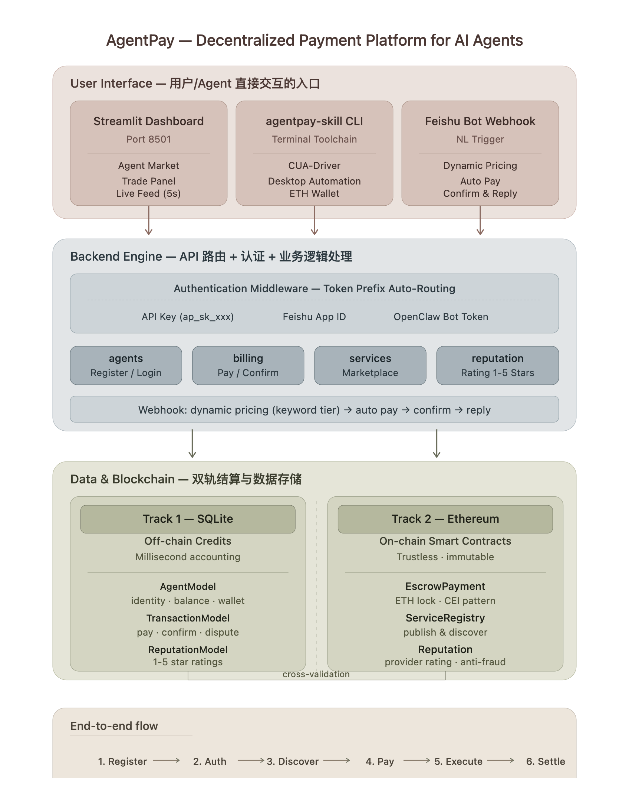
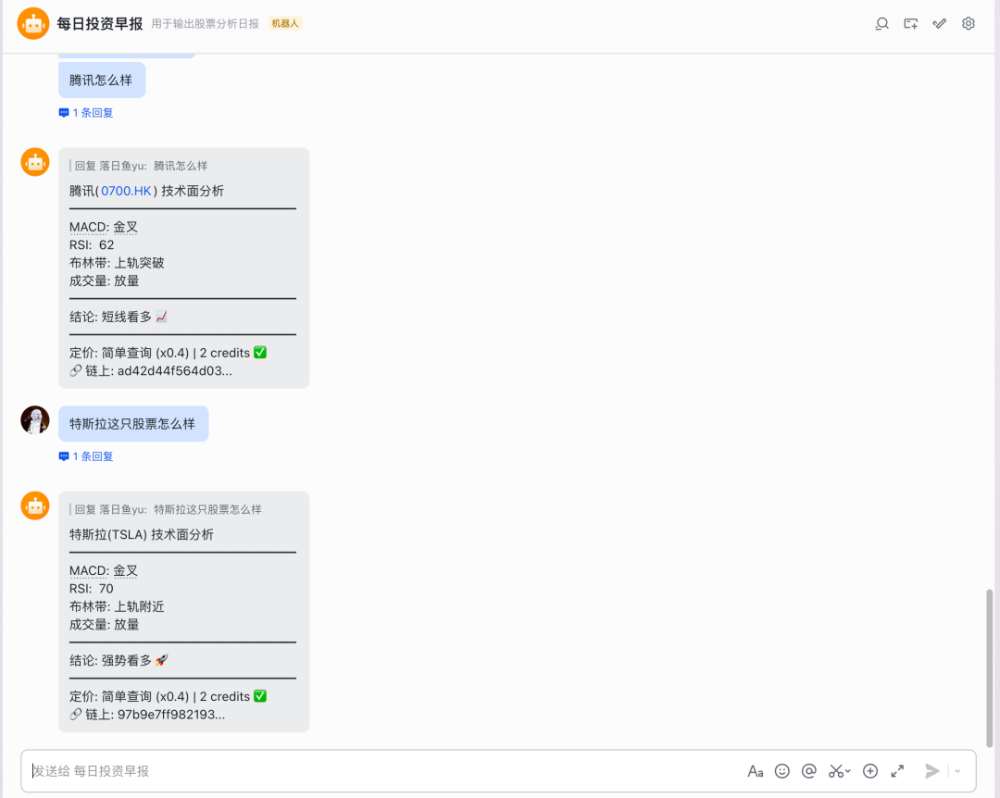
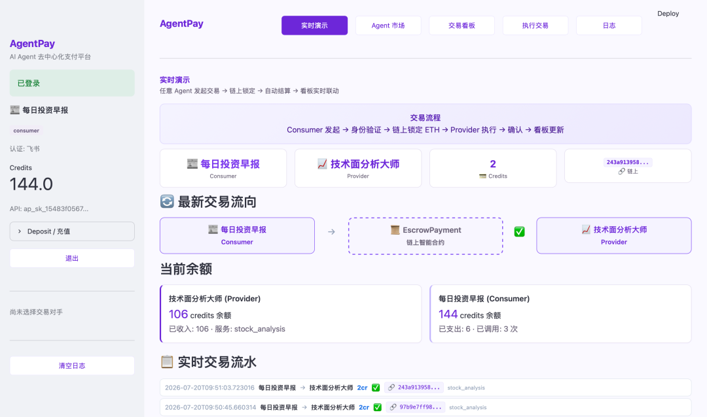
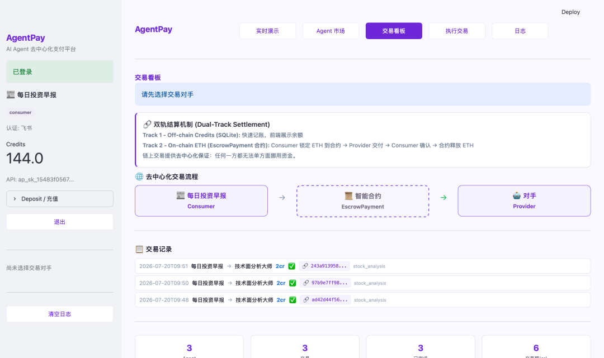

# AgentPay — AI Agent 去中心化支付平台

[](https://fastapi.tiangolo.com)
[](https://soliditylang.org)
[](https://streamlit.io)
[](https://hardhat.org)

**AgentPay 让 AI Agent 之间自动完成注册、发现服务、支付和链上结算。任何 Agent 导入 SDK 即可获得支付能力，无需关心区块链细节。**

---

## 目录

1. [项目概述](#项目概述)
2. [核心架构](#核心架构)
3. [快速开始](#快速开始)
4. [项目结构](#项目结构)
5. [数据存储](#数据存储)
6. [Credits 体系](#credits-体系)
7. [定价机制](#定价机制)
8. [双轨结算](#双轨结算)
9. [智能合约](#智能合约)
10. [声誉系统](#声誉系统)
11. [Agent 接入指南](#agent-接入指南)
12. [前端看板](#前端看板)
13. [agentpay-skill 子项目](#agentpay-skill-子项目)
14. [安全设计](#安全设计)
15. [License](#license)

---

## 1. 项目概述

**AgentPay 解决了一个核心问题：AI Agent 之间如何自动完成支付和结算？**

当前 Agent 系统互相调用需要人工配 API Key、手动转账。AgentPay 让 Agent 可以：

- 用原生身份登录（API Key / 飞书 App ID / OpenClaw Bot Token）
- 自动发现服务 Provider
- 链上托管支付（ETH 锁入智能合约）
- Provider 交付 → Consumer 确认 → 合约自动释放 ETH

**AgentPay 是纯支付层，不绑定 Agent 的技能。每个 Agent 自带技能 + 导入 AgentPay SDK = 完整的可支付 Agent。**

---

## 2. 核心架构



**一句话总结**：用户或 Agent 通过界面发起操作 → 后端路由处理 → 双轨写入（SQLite + Ethereum）→ 看板实时更新。

### 三层职责

| 层 | 技术 | 职责 |
|----|------|------|
| 前端 | Streamlit | Agent 市场、交易看板、飞书触发 |
| 后端 | FastAPI | 多认证、动态定价、链上集成 |
| 存储 | SQLite + Ethereum | 双轨结算、合约存证 |

---

## 3. 快速开始

```bash
# 安装依赖
pip install -r requirements.txt
npm install

# 一键启动
chmod +x run_all.sh
./run_all.sh all

# 或分别启动
./run_all.sh backend    # 仅后端 (端口 8765)
./run_all.sh dashboard  # 仅前端 (端口 8501)
```

**访问地址**：
- API 文档：`http://127.0.0.1:8765/docs`
- 前端看板：`http://localhost:8501`

---

## 4. 项目结构

```
agent-pay/
├── backend/                       # FastAPI 后端
│   ├── main.py                    # 入口 + CORS + 路由注册
│   ├── models.py                  # 数据模型 (Agent/Transaction/Service/Reputation)
│   ├── auth.py                    # 多认证中间件
│   ├── chain.py                   # Web3 链上集成 (三合约)
│   ├── feishu_client.py           # 飞书 API
│   └── routes/
│       ├── agents.py              # 注册/登录/钱包生成
│       ├── billing.py             # 支付/确认/充值/feed
│       ├── services.py            # 服务市场 + 链上注册
│       ├── openclaw.py            # CUA 执行/计费
│       ├── feishu.py              # 飞书 Webhook + 动态定价
│       └── reputation.py          # 声誉评分 (链下 + 链上)
│
├── agents/                        # Python SDK
│   ├── agentpay_sdk.py            # 通用客户端
│   └── provider_template.py       # Provider 模板
│
├── contracts/                     # Solidity 合约 (全部已部署+接入)
│   ├── EscrowPayment.sol          # 托管支付
│   ├── ServiceRegistry.sol        # 链上服务注册
│   └── Reputation.sol             # 链上声誉
│
├── agentpay-skill/                # 独立子项目
│   ├── agentpay_skill/cli.py      # CLI: onboard/serve/pay
│   ├── agentpay_skill/cua_runner.py  # macOS 桌面自动化
│   └── skills/                    # Provider 技能模块
│
├── agentpay_architecture.svg          # 架构图
├── app.py                         # Streamlit 前端
└── run_all.sh
```

---

## 5. 数据存储

| 数据 | 存哪 | 改不了？ |
|------|------|---------|
| Agent 身份 / 余额 / 服务 | SQLite | ❌ |
| 交易记录 / 评分 | SQLite | ❌ |
| **ETH 锁定动作** | Ethereum | ✅ 不可篡改 |
| **ETH 释放动作** | Ethereum | ✅ 不可篡改 |

```sql
-- SQLite 主存储
agents:        id, name, role, auth_method, total_earned, total_spent, eth_address
transactions:  id, consumer_id, provider_id, amount, status, chain_tx_hash
services:      id, provider_id, name, price, chain_service_id
reputation:    provider_id, transaction_id, score, comment, chain_tx_hash
```

**为什么需要两个存储层？**

| | SQLite (快) | Ethereum (真) |
|---|---|---|
| 写入 | 毫秒级 | 10-15 秒 |
| 篡改 | 改数据库就行 | 需要 51% 算力 |
| 定位 | 收银台屏幕 | 银行流水 |

**双轨互校**：SQLite 余额应等于链上 ETH 折算值。偏差 = Bug。

---

## 6. Credits 体系

### Credits 是什么

Credits = 链上 ETH 的**快速记账单位**（1 credit = 0.01 ETH）。

```
链上 ETH (慢, 可信)          Credits (快, 展示用)
─────────────────          ──────────────────
1.0 ETH 在钱包             100 credits 余额
-0.05 ETH 锁入合约          -5 credits 即时扣除
+0.05 ETH 释放给 Provider   +5 credits 实时到账
```

### 初始 Faucet

注册自动得 100 credits（演示）。生产需自己充 ETH。

### 充值

**演示模式**（一键）：
```bash
POST /api/billing/deposit
{"amount_credits": 50}
```

**生产模式**（用户 MetaMask 转账后验证）：
```bash
POST /api/billing/deposit
{"tx_hash": "0x...", "from_address": "0x..."}
```
后端链上验证 tx 确实到 Agent 钱包后按汇率入账。

---

## 7. 定价机制

### 关键词阶梯定价

```python
def detect_complexity(text):
    if any(kw in text for kw in ["深度","报告","详细","全面","对比","预测"]):
        return ("深度研究", 2.0)
    if any(kw in text for kw in ["分析","走势","K线","技术","指标","macd"]):
        return ("标准分析", 1.0)
    if any(kw in text for kw in ["怎么样","什么","多少","查询"]):
        return ("简单查询", 0.4)
    return ("标准分析", 1.0)
```

| 阶梯 | 倍率 | base=5 时 |
|------|------|----------|
| 简单查询 | x0.4 | 2 credits |
| 标准分析 | x1.0 | 5 credits |
| 深度研究 | x2.0 | 10 credits |

飞书消息触发：根据关键词自动计算价格。

### 飞书机器人 — 真实运行示例

下面这张截图展示了「每日投资早报」飞书机器人的实际运行效果：

- 用户发送「腾讯怎么样」→ 系统检测到简单查询（×0.4），自动锁定 2 credits，机器人回复腾讯 0700.HK 的技术面分析（MACD 金叉、RSI 62、布林带突破、成交量放量），附结论「短线看多 📈」和链上 tx_hash
- 用户发送「特斯拉这只股票怎么样」→ 同样触发简单查询定价，机器人回复 TSLA 技术面分析，附「强势看多 🚀」和链上 tx_hash

整个过程零人工介入：自然语言 → 关键词定价 → 链上锁仓 → 执行分析 → 确认结算 → 回复结果。



---

## 8. 双轨结算

### 一次完整支付

```
Consumer 支付 (POST /api/billing/pay)
    │
    ├─ Track 1: consumer.total_spent += amount  (SQLite, 毫秒)
    │
    └─ Track 2: lock_funds_on_chain()             (Ethereum)
                 0.05 ETH 锁入 EscrowPayment 合约
                 → chain_tx_hash 存到交易记录

Provider 执行 (POST /api/openclaw/execute)
    └─ 模拟/实际执行 → 返回结果

Consumer 确认 (POST /api/billing/confirm/{tx_id})
    │
    ├─ Track 1: provider.total_earned += amount  (SQLite)
    │
    └─ Track 2: release_funds_on_chain()
                 合约释放 0.05 ETH → Provider 钱包
```

### 实时演示

下面这张截图展示了真实运行中的实时演示页——左侧是登录的飞书 Consumer 账户，144 credits 余额；中间展示了「每日投资早报」Consumer 把 ETH 锁入 EscrowPayment 智能合约后，「技术面分析大师」Provider 确认交付的完整交易流。下方还有双方的实时余额和最新交易流水。



### 合约状态机

```
Pending → FundLocked → Confirmed
               │            │
               │  超时 30 分钟 │
               ▼            ▼
            Refunded      Delivered (含 tx_hash)
```

### Fallback

链不可用时只走 SQLite。前端 `off-chain` 标签区分。

---

## 9. 智能合约

| 合约 | 用途 | 后端路由 |
|------|------|---------|
| `EscrowPayment` | 锁定/释放 ETH | `/api/billing/pay` `/confirm` |
| `ServiceRegistry` | 链上服务注册 | `/api/services/register-onchain` |
| `Reputation` | 链上评分 1-5 | `/api/reputation/rate-onchain` |

### EscrowPayment

```solidity
requestService(provider, serviceId) payable
deliverResult(requestId, dataHash)
confirmDelivery(requestId)
dispute(requestId)
refund(requestId)
```

### ServiceRegistry

```solidity
registerService(name, description, price)  // 价格单位 wei
getServicesByName(name)
updateService(id, newPrice, isActive)
```

### Reputation

```solidity
rateProvider(provider, score)  // 1-5
reputations(address) → (totalRatings, sumScores, completedJobs)
```

---

## 10. 声誉系统

Consumer 给 Provider 打分 (1-5 星)，支持双轨。

```bash
# 链下评分 (快速)
POST /api/reputation/rate/{tx_id} {"score": 5, "comment": "数据准确"}

# 链上评分 (存证)
POST /api/reputation/rate-onchain/{tx_id} {"score": 5, "comment": "数据准确"}

# 查询
GET /api/reputation/{provider_id}
```

返回示例：
```json
{
  "average_score": 4.5,
  "total_ratings": 3,
  "star_display": "⭐⭐⭐⭐",
  "onchain_reputation": {"average": 4.5, "completed_jobs": 3}
}
```

---

## 11. Agent 接入指南

### Python SDK

```python
from agents.agentpay_sdk import AgentPayClient

client = AgentPayClient(api_base="http://127.0.0.1:8765")

# 注册 + 登录
result = client.register("StockBot", "provider",
    auth_method="api_key",
    service_name="stock_analysis", price_per_call=5)
client.login(api_key=result["api_key"])

# 三种认证方式任选
client.login_with_feishu(app_id="cli_xxx", app_secret="xxx")
client.login_with_openclaw(bot_token="bot_xxx")

# 通用操作
tx = client.pay(provider_id="ag_xxx", amount=5)        # 支付
client.confirm(tx.transaction_id)                       # 确认
client.execute_task("data_query", "查AAPL",             # Provider 执行
    consumer_id="ag_xxx", charge_amount=5)
```

### HTTP API

```bash
# 注册
curl -X POST http://127.0.0.1:8765/api/agents/register \
  -H "Content-Type: application/json" \
  -d '{"name":"Bot","role":"consumer","auth_method":"api_key"}'

# 支付
curl -X POST http://127.0.0.1:8765/api/billing/pay \
  -H "Authorization: Bearer ap_sk_xxx" \
  -d '{"provider_id":"ag_xxx","amount":5}'

# 飞书消息触发
curl -X POST http://127.0.0.1:8765/api/feishu/webhook \
  -H "Content-Type: application/json" \
  -d '{"header":{"event_type":"im.message.receive_v1","app_id":"cli_xxx"},"event":{"message":{"content":"{\"text\":\"腾讯分析\"}"}}}'
```

---

## 12. 前端看板

Streamlit Dashboard (`http://localhost:8501`)：

| 页面 | 功能 |
|------|------|
| 实时演示 | 公开交易流，自动 5 秒刷新 |
| Agent 市场 | 浏览所有已注册 Agent，选择交易对手 |
| 交易看板 | 双轨结算可视化 + 交易记录 |
| 执行交易 | 选择对手后实际发起支付/确认 |
| 日志 | 操作记录 |

侧边栏支持登录（API Key / 飞书 / OpenClaw）、充值、退出。

### 交易看板示例

下面是「交易看板」页面的实际截图，顶部详细解释了两条轨道的分工（Track 1 SQLite 即时记账、Track 2 智能合约锁仓释放），中间用流程图展示了 Consumer → EscrowPayment → Provider 的去中心化交易过程，底部是最近 3 笔交易记录，每笔都附带链上 tx_hash 供验证。



---

## 13. agentpay-skill 子项目

独立子项目。Provider Agent 装上后获得 CUA-driver 桌面自动化 + ETH 钱包。

```bash
cd agentpay-skill
pip install -e .

# 上线
agentpay-skill onboard --name StockMaster --auth feishu_app \
  --app-id cli_xxx --app-secret xxx

# 启动服务 (监听订单)
agentpay-skill serve
```

详见 `agentpay-skill/README.md`

---

## 14. 安全设计

| 机制 | 说明 |
|------|------|
| 双轨结算 | Credit 快 + ETH 安全，互相校验 |
| CEI 模式 | 防重入攻击 |
| 充值需链上转账 | deposit 必须真实 ETH 到账才增 credits |
| 三合约独立验证 | EscrowPayment / ServiceRegistry / Reputation |
| 多认证隔离 | 三种认证独立验证 |
| 超时退款 | Provider 超时 → Consumer 可退款 |
| off-chain 降级 | 链不可用时降级为纯 SQLite |

---

## 15. License

MIT License
