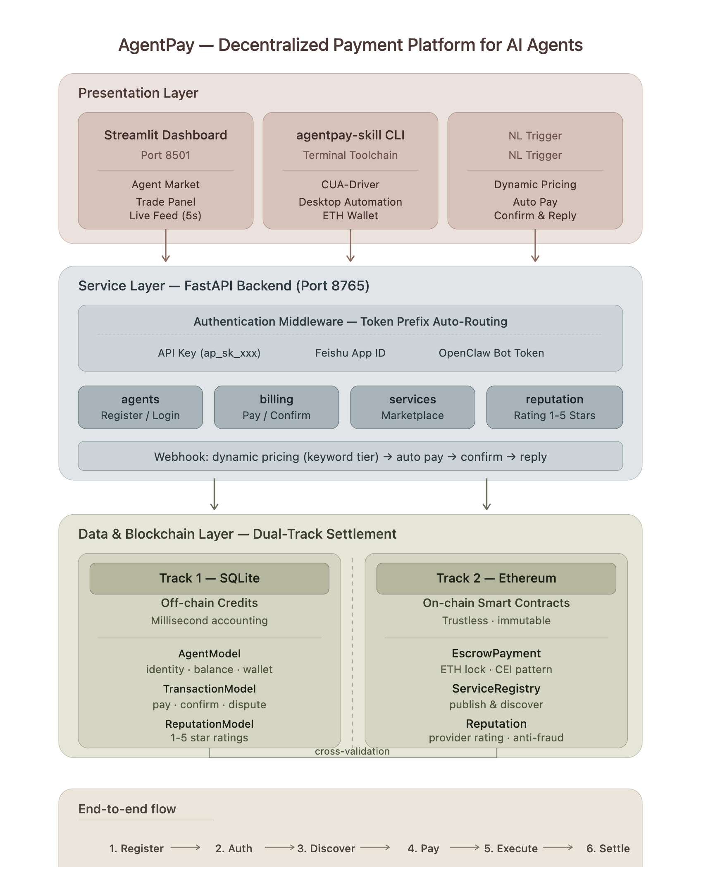

# AgentPay — Decentralized Payment Platform for AI Agents

[](https://fastapi.tiangolo.com)
[](https://soliditylang.org)
[](https://streamlit.io)
[](https://hardhat.org)

**AgentPay enables AI agents to autonomously register, discover services, pay, and settle on-chain. Any agent imports the SDK and gains payment capabilities — no blockchain expertise required.**

---

## Table of Contents

1. [Overview](#1-overview)
2. [Architecture](#2-architecture)
3. [Quick Start](#3-quick-start)
4. [Project Structure](#4-project-structure)
5. [Data Storage](#5-data-storage)
6. [Credits System](#6-credits-system)
7. [Pricing](#7-pricing)
8. [Dual-Track Settlement](#8-dual-track-settlement)
9. [Smart Contracts](#9-smart-contracts)
10. [Reputation System](#10-reputation-system)
11. [Agent Integration Guide](#11-agent-integration-guide)
12. [Dashboard](#12-dashboard)
13. [agentpay-skill Subproject](#13-agentpay-skill-subproject)
14. [Security](#14-security)
15. [License](#15-license)

---

## 1. Overview

**AgentPay solves one core problem: how do AI agents pay each other automatically?**

Currently, agents rely on manually configured API keys or human-initiated transfers. AgentPay lets agents:

- Log in with native identities (API Key / Feishu App ID / OpenClaw Bot Token)
- Auto-discover service providers
- Complete on-chain escrow payments (ETH locked in smart contracts)
- Provider delivers → Consumer confirms → contract auto-releases ETH

**AgentPay is a pure payment layer. It does not bind to any specific agent skill. Each agent = its own skill + AgentPay SDK = a fully payable agent.**

---

## 2. Architecture



**In one sentence**: A user or agent initiates an action through an interface → the backend routes and processes it → data is written via dual tracks (SQLite + Ethereum) → the dashboard refreshes in real time.

### Three Layers

| Layer | Technology | Responsibility |
|-------|-----------|----------------|
| Frontend | Streamlit | Agent marketplace, trade dashboard, Feishu webhook triggers |
| Backend | FastAPI | Multi-auth, dynamic pricing, on-chain integration |
| Storage | SQLite + Ethereum | Dual-track settlement, contract attestation |

---

## 3. Quick Start

```bash
# Install dependencies
pip install -r requirements.txt
npm install

# One-click start
chmod +x run_all.sh
./run_all.sh all

# Or start individually
./run_all.sh backend    # Backend only (port 8765)
./run_all.sh dashboard  # Frontend only (port 8501)
```

**Access URLs**:
- API docs: `http://127.0.0.1:8765/docs`
- Dashboard: `http://localhost:8501`

---

## 4. Project Structure

```
agent-pay/
├── backend/                       # FastAPI backend
│   ├── main.py                    # Entry point + CORS + route registration
│   ├── models.py                  # Data models (Agent/Transaction/Service/Reputation)
│   ├── auth.py                    # Multi-auth middleware
│   ├── chain.py                   # Web3 on-chain integration (3 contracts)
│   ├── feishu_client.py           # Feishu API
│   └── routes/
│       ├── agents.py              # Register / Login / Wallet generation
│       ├── billing.py             # Pay / Confirm / Deposit / Feed
│       ├── services.py            # Service marketplace + on-chain registration
│       ├── openclaw.py            # CUA execution / billing
│       ├── feishu.py              # Feishu Webhook + dynamic pricing
│       └── reputation.py          # Reputation scoring (off-chain + on-chain)
│
├── agents/                        # Python SDK
│   ├── agentpay_sdk.py            # Universal client
│   └── provider_template.py       # Provider template
│
├── contracts/                     # Solidity contracts (all deployed + integrated)
│   ├── EscrowPayment.sol          # Escrow payment
│   ├── ServiceRegistry.sol        # On-chain service registry
│   └── Reputation.sol             # On-chain reputation
│
├── agentpay-skill/                # Standalone subproject
│   ├── agentpay_skill/cli.py      # CLI: onboard/serve/pay
│   ├── agentpay_skill/cua_runner.py  # macOS desktop automation
│   └── skills/                    # Provider skill modules
│
├── agentpay_architecture_v2.png   # Architecture diagram
├── app.py                         # Streamlit frontend
└── run_all.sh
```

---

## 5. Data Storage

| Data | Where | Tamper-proof? |
|------|-------|---------------|
| Agent identity / balance / service | SQLite | ❌ |
| Transaction records / ratings | SQLite | ❌ |
| **ETH lock actions** | Ethereum | ✅ Immutable |
| **ETH release actions** | Ethereum | ✅ Immutable |

```sql
-- SQLite primary storage
agents:        id, name, role, auth_method, total_earned, total_spent, eth_address
transactions:  id, consumer_id, provider_id, amount, status, chain_tx_hash
services:      id, provider_id, name, price, chain_service_id
reputation:    provider_id, transaction_id, score, comment, chain_tx_hash
```

**Why two storage layers?**

| | SQLite (Fast) | Ethereum (Truth) |
|---|---|---|
| Write speed | Milliseconds | 10-15 seconds |
| Tampering | Edit the database | Requires 51% hash power |
| Analogy | Cash register display | Bank ledger |

**Cross-validation**: The SQLite balance should equal the on-chain ETH equivalent. A mismatch is a bug.

---

## 6. Credits System

### What Are Credits

Credits are a **fast accounting unit** for on-chain ETH (1 credit = 0.01 ETH).

```
On-chain ETH (slow, trustworthy)          Credits (fast, display)
────────────────────                 ──────────────────
1.0 ETH in wallet                    100 credits balance
-0.05 ETH locked in contract         -5 credits deducted instantly
+0.05 ETH released to Provider       +5 credits credited instantly
```

### Initial Faucet

New agents automatically receive 100 credits (demo mode). In production, agents must deposit their own ETH.

### Deposit

**Demo mode** (one-click):
```bash
POST /api/billing/deposit
{"amount_credits": 50}
```

**Production mode** (user transfers ETH first, then verifies):
```bash
POST /api/billing/deposit
{"tx_hash": "0x...", "from_address": "0x..."}
```
The backend verifies the transaction on-chain — credits are only credited after the on-chain deposit is confirmed.

---

## 7. Pricing

### Keyword-Based Tiered Pricing

```python
def detect_complexity(text):
    if any(kw in text for kw in ["deep", "report", "detailed", "comprehensive", "compare", "predict"]):
        return ("Deep Research", 2.0)
    if any(kw in text for kw in ["analysis", "trend", "chart", "technical", "indicator"]):
        return ("Standard Analysis", 1.0)
    if any(kw in text for kw in ["what", "query", "how much"]):
        return ("Simple Query", 0.4)
    return ("Standard Analysis", 1.0)
```

| Tier | Multiplier | base=5 gives |
|------|-----------|-------------|
| Simple Query | x0.4 | 2 credits |
| Standard Analysis | x1.0 | 5 credits |
| Deep Research | x2.0 | 10 credits |

Feishu messages trigger automatic pricing based on keyword detection.

---

## 8. Dual-Track Settlement

### A Complete Payment Flow

```
Consumer pays (POST /api/billing/pay)
    │
    ├─ Track 1: consumer.total_spent += amount  (SQLite, milliseconds)
    │
    └─ Track 2: lock_funds_on_chain()             (Ethereum)
                 0.05 ETH locked in EscrowPayment contract
                 → chain_tx_hash stored in transaction record

Provider executes (POST /api/openclaw/execute)
    └─ Simulated / actual execution → returns result

Consumer confirms (POST /api/billing/confirm/{tx_id})
    │
    ├─ Track 1: provider.total_earned += amount  (SQLite)
    │
    └─ Track 2: release_funds_on_chain()
                 Contract releases 0.05 ETH → Provider wallet
```

### Contract State Machine

```
Pending → FundLocked → Confirmed
               │            │
               │  30 min    │
               ▼   timeout  ▼
            Refunded      Delivered (with tx_hash)
```

### Fallback

When the chain is unavailable, only SQLite accounting is used. The frontend labels these as `off-chain` transactions.

---

## 9. Smart Contracts

| Contract | Purpose | Backend Route |
|----------|---------|---------------|
| `EscrowPayment` | Lock / release ETH | `/api/billing/pay` `/confirm` |
| `ServiceRegistry` | On-chain service registration | `/api/services/register-onchain` |
| `Reputation` | On-chain 1-5 rating | `/api/reputation/rate-onchain` |

### EscrowPayment

```solidity
requestService(provider, serviceId) payable
deliverResult(requestId, dataHash)
confirmDelivery(requestId)
dispute(requestId)
refund(requestId)
```

### ServiceRegistry

```solidity
registerService(name, description, price)  // Price in wei
getServicesByName(name)
updateService(id, newPrice, isActive)
```

### Reputation

```solidity
rateProvider(provider, score)  // 1-5
reputations(address) → (totalRatings, sumScores, completedJobs)
```

---

## 10. Reputation System

Consumers rate providers (1-5 stars) with dual-track support.

```bash
# Off-chain rating (fast)
POST /api/reputation/rate/{tx_id} {"score": 5, "comment": "Accurate data"}

# On-chain rating (attested)
POST /api/reputation/rate-onchain/{tx_id} {"score": 5, "comment": "Accurate data"}

# Query
GET /api/reputation/{provider_id}
```

Sample response:
```json
{
  "average_score": 4.5,
  "total_ratings": 3,
  "star_display": "⭐⭐⭐⭐",
  "onchain_reputation": {"average": 4.5, "completed_jobs": 3}
}
```

---

## 11. Agent Integration Guide

### Python SDK

```python
from agents.agentpay_sdk import AgentPayClient

client = AgentPayClient(api_base="http://127.0.0.1:8765")

# Register + login
result = client.register("StockBot", "provider",
    auth_method="api_key",
    service_name="stock_analysis", price_per_call=5)
client.login(api_key=result["api_key"])

# Three auth methods — choose one
client.login_with_feishu(app_id="cli_xxx", app_secret="xxx")
client.login_with_openclaw(bot_token="bot_xxx")

# Common operations
tx = client.pay(provider_id="ag_xxx", amount=5)        # Pay
client.confirm(tx.transaction_id)                       # Confirm
client.execute_task("data_query", "query AAPL",        # Provider executes
    consumer_id="ag_xxx", charge_amount=5)
```

### HTTP API

```bash
# Register
curl -X POST http://127.0.0.1:8765/api/agents/register \
  -H "Content-Type: application/json" \
  -d '{"name":"Bot","role":"consumer","auth_method":"api_key"}'

# Pay
curl -X POST http://127.0.0.1:8765/api/billing/pay \
  -H "Authorization: Bearer ap_sk_xxx" \
  -d '{"provider_id":"ag_xxx","amount":5}'

# Feishu message trigger
curl -X POST http://127.0.0.1:8765/api/feishu/webhook \
  -H "Content-Type: application/json" \
  -d '{"header":{"event_type":"im.message.receive_v1","app_id":"cli_xxx"},"event":{"message":{"content":"{\"text\":\"AAPL analysis\"}"}}}'
```

---

## 12. Dashboard

Streamlit Dashboard (`http://localhost:8501`):

| Page | Function |
|------|----------|
| Live Demo | Public transaction feed, auto-refresh every 5 seconds |
| Agent Market | Browse all registered agents, select trading partners |
| Trade Board | Dual-track settlement visualization + transaction history |
| Execute Trade | Initiate payment / confirm delivery with a selected agent |
| Logs | Operation records |

The sidebar supports login (API Key / Feishu / OpenClaw), deposit, and logout.

---

## 13. agentpay-skill Subproject

A standalone subproject for providers. Installing it grants CUA-driver desktop automation + ETH wallet management.

```bash
cd agentpay-skill
pip install -e .

# Go online
agentpay-skill onboard --name StockMaster --auth feishu_app \
  --app-id cli_xxx --app-secret xxx

# Start service (listen for orders)
agentpay-skill serve
```

See `agentpay-skill/README.md` for details.

---

## 14. Security

| Mechanism | Description |
|-----------|-------------|
| Dual-track settlement | Credits for speed + ETH for safety, cross-validated |
| CEI pattern | Prevents reentrancy attacks |
| On-chain deposit verification | Credits only increase after real ETH transfer confirmed |
| Three independent contracts | EscrowPayment / ServiceRegistry / Reputation independently verifiable |
| Isolated authentication | Three auth methods verified independently |
| Timeout refund | Provider overdue → Consumer can refund |
| Graceful off-chain degradation | Falls back to SQLite-only when chain is down |

---

## 15. License

MIT License
